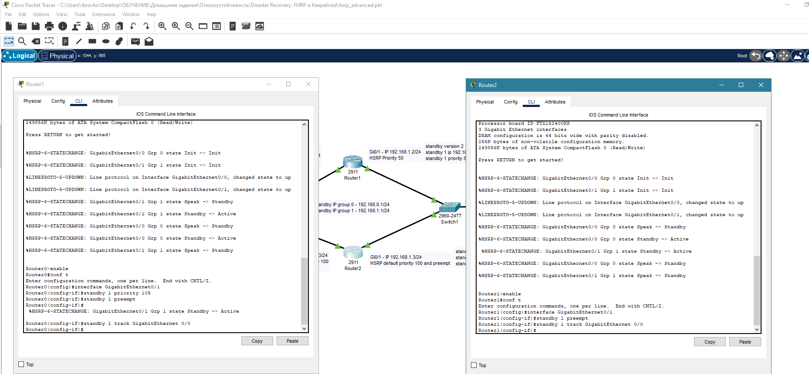
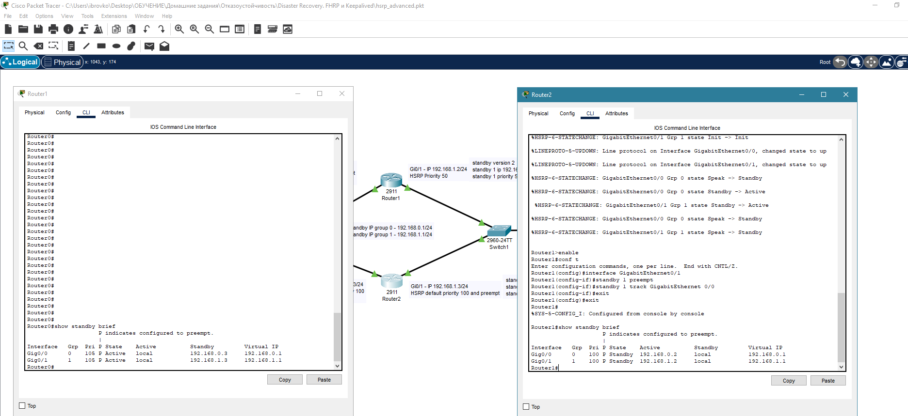
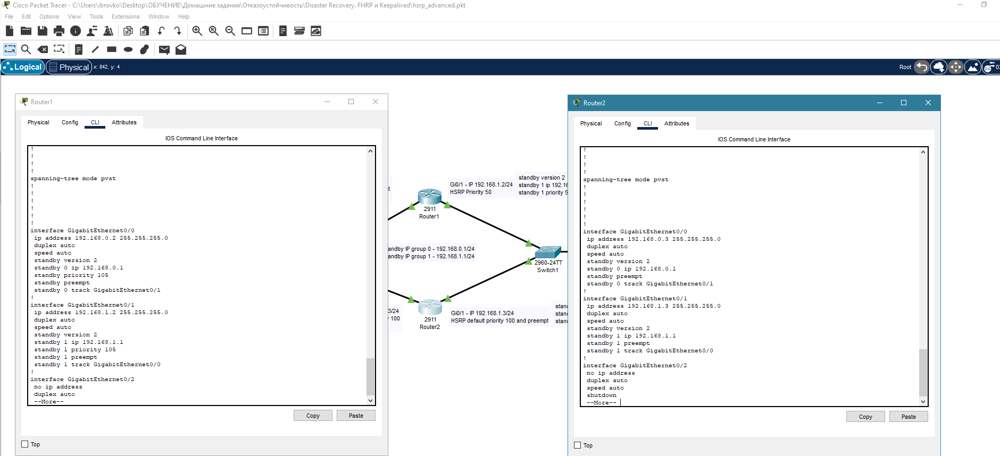
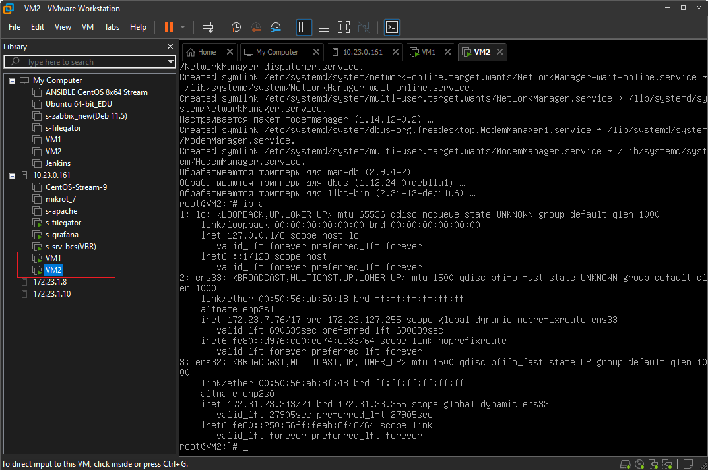

# Домашнее задание к занятию 1 «Disaster recovery и Keepalived» - Бровко И. Г.

------

### Задание 1
- Дана [схема](1/hsrp_advanced.pkt) для Cisco Packet Tracer, рассматриваемая в лекции.
- На данной схеме уже настроено отслеживание интерфейсов маршрутизаторов Gi0/1 (для нулевой группы)
- Необходимо аналогично настроить отслеживание состояния интерфейсов Gi0/0 (для первой группы).
- Для проверки корректности настройки, разорвите один из кабелей между одним из маршрутизаторов и Switch0 и запустите ping между PC0 и Server0.
- На проверку отправьте получившуюся схему в формате pkt и скриншот, где виден процесс настройки маршрутизатора.
---
* схема в формате pkt 
* процесс настройки маршрутизаторов 
* конфиг маршрутизаторов 
* 
------

### Задание 2
- Запустите две виртуальные машины Linux, установите и настройте сервис Keepalived как в лекции, используя пример конфигурационного [файла](1/keepalived-simple.conf).
- Настройте любой веб-сервер (например, nginx или simple python server) на двух виртуальных машинах
- Напишите Bash-скрипт, который будет проверять доступность порта данного веб-сервера и существование файла index.html в root-директории данного веб-сервера.
- Настройте Keepalived так, чтобы он запускал данный скрипт каждые 3 секунды и переносил виртуальный IP на другой сервер, если bash-скрипт завершался с кодом, отличным от нуля (то есть порт веб-сервера был недоступен или отсутствовал index.html). Используйте для этого секцию vrrp_script
- На проверку отправьте получившейся bash-скрипт и конфигурационный файл keepalived, а также скриншот с демонстрацией переезда плавающего ip на другой сервер в случае недоступности порта или файла index.html
---
* Запущены две виртуальные машины VM1 IP 172.23.7.77 будет использованна в качестве MASTER и VM2 IP 172.23.7.76 с установленным и насртроенным сервисом Keepalived 
* Сервис Nginx установлен и настроен на двух ВМ, доступен на виртуальном ip-адресе 172.23.10.10
* bash-скрипт 
* конфигурационный файл keepalived (на MASTER сервере) 
* gif с демонстрацией переезда плавающего ip на другой сервер в случае недоступности порта 
* gif с демонстрацией переезда плавающего ip на другой сервер в случае недоступности файла index.html 
