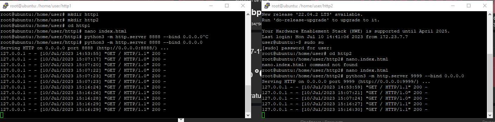

# Домашнее задание к занятию 2 «Кластеризация и балансировка нагрузки» - Бровко И Г

------

### Задание 1
- Запустите два simple python сервера на своей виртуальной машине на разных портах
- Установите и настройте HAProxy, воспользуйтесь материалами к лекции по [ссылке](2/)
- Настройте балансировку Round-robin на 4 уровне.
- На проверку направьте конфигурационный файл haproxy, скриншоты, где видно перенаправление запросов на разные серверы при обращении к HAProxy.
---
* запущено два simple python сервера на разных портах 
* установлен и настроен HAProxy
* настроена балансировка Round-robin на 4 уровне
* 
* 
* конфигурационный файл haproxy 

### Задание 2
- Запустите три simple python сервера на своей виртуальной машине на разных портах
- Настройте балансировку Weighted Round Robin на 7 уровне, чтобы первый сервер имел вес 2, второй - 3, а третий - 4
- HAproxy должен балансировать только тот http-трафик, который адресован домену example.local
- На проверку направьте конфигурационный файл haproxy, скриншоты, где видно перенаправление запросов на разные серверы при обращении к HAProxy c использованием домена example.local и без него.
---
* конфигурационный файл haproxy 
* перенаправление запросов на разные серверы при обращении к HAProxy c использованием домена example.local 
* перенаправление запросов на разные серверы при обращении к HAProxy без использования домена example.local 
---
